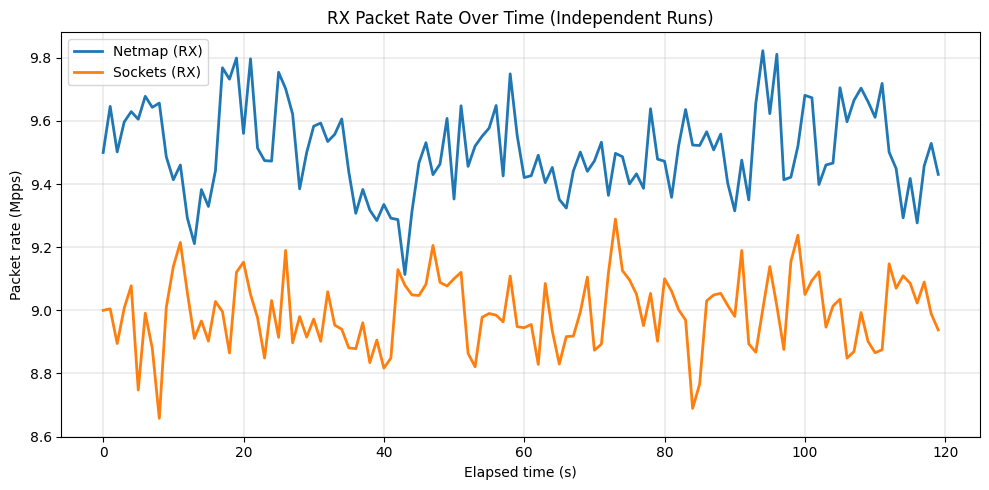

[](https://www.linkedin.com/in/alexisdrobles/)
[](mailto:alexis.robles49@gmail.com)
[](https://github.com/al3xisrobles)
[](https://alexis-robles.com)

# Fast User-Space Network Packet Filter for HFT

_How can modern OS and hardware features be used to build ultra-low-latency trading infrastructure?_

I present a high-performance, user-space network packet filter optimized for low-latency trading environments on Linux. Traditional network packet filtering solutions rely heavily on kernel-space processing, introducing unnecessary context switch overhead, system call latency, and buffer copying inefficiencies. By bypassing the kernel’s traditional networking stack and implementing user-space packet filtering, this project explores the fundamental trade-offs in networking performance and HFT infrastructure optimizations.

---

## Running

First, make sure you have **netmap** installed on your Linux machine. Instructions for building and installing netmap can be found here: [Netmap GitHub Repository](https://github.com/luigirizzo/netmap).

Build the project (requires netmap headers/libs on the system):

```bash
make
```

Run on a netmap port (example):

```bash
sudo -E USPF_DEBUG=1 ./build/user_space_packet_filter -i netmap:eth0 -p 12345 -c 0 -b 256 -r 15
```

- -i netmap interface (netmap:eth0, vale:sw{1, etc.)
- -p UDP dst port to accept (0 = any)
- -c pin RX thread to CPU core id
- -b batch size per ring poll
- -r seconds to print stats before exit
- USPF_DEBUG=1 (env var) enables detailed debug logging for development and troubleshooting

---

## Background

In HFT, nanoseconds matter. Every microsecond of delay between receiving market data and placing an order can determine profitability. As a result, traders must process high-velocity financial data feeds in real-time, without waiting for the operating system’s traditional networking stack to handle incoming packets.

Standard networking packet processing is too slow. Usually, Linux processes network packets in multiple steps:

1. The network interface controller (NIC) receives a packet and DMAs it into a kernel buffer.
2. The NIC driver triggers an interrupt to notify the CPU that a new packet is ready.
3. The kernel processes the packet, handling firewall rules, routing, and TCP/IP logic.
4. To make the data available to applications, the kernel must copy the relevant portion of that buffer into user-space memory.
5. Only then can the trading system process the packet and make decisions.

This process introduces context switch overhead, memory copies, and system call latency. While acceptable in general computing, it's far too slow for HFT, where microseconds can mean millions. To eliminate these bottlenecks, low-latency trading systems (1) skip the network stack entirely and (2) move packet processing and filtering as close to the wire as possible.

Kernel-bypass frameworks like netmap provide a path forward. Netmap exposes NIC rings directly to user space, allowing applications to read packets without traversing the full socket stack. By avoiding context switches and memory copies, netmap achieves predictable, microsecond-scale packet delivery.

A packet filter early in the stack is also critical: if the trading engine only needs a small subset of messages (e.g., order book updates for a specific instrument), discarding irrelevant traffic at capture time saves CPU cycles and reduces the downstream load.

Alternative frameworks such as DPDK offer similar performance, but with trade-offs: DPDK requires dedicated NIC drivers and machine-specific tuning, often binding entire cores and interfaces exclusively to user-space applications. Netmap, by contrast, integrates cleanly with standard NIC drivers and provides a simpler model for experimentation while still delivering kernel-bypass performance.

---

## Methods

This project combines kernel-bypass networking with careful systems-level design, using both high-level frameworks and low-level optimizations. At the highest level, packet I/O is handled by netmap, with vale virtual switching used for development in cloud environments (e.g., EC2, where ENA NICs are unsupported by netmap) and bare-metal NICs used for benchmarking real throughput and latency. Netmap provides zero-copy access to network interface rings, bypassing the kernel’s TCP/IP stack and avoiding costly syscalls, context switches, and buffer copies.

On the software engineering side, the system is written in C++17 and organized into modular components:

- **BypassIO** handles direct interaction with netmap descriptors and rings, managing synchronization (`NIOCRXSYNC`, `NIOCTXSYNC`) and burst reads/writes.
- **PacketCapture** wraps the I/O layer and exposes a pump-style API, applying filtering and passing packets downstream.
- **PacketFilter** validates that packets are IPv4/UDP, match the configured UDP destination port, and conform to the 14-byte market data payload schema (arbitrarily chosen since this project is a POC).
- **TradingEngine** consumes decoded ticks and runs lightweight strategy logic (a placeholder mean-reversion rule, again because the main focus of this project is packet processing speed, not the systematic trading algorithm).
- **nm_md_sender** generates test traffic by constructing raw Ethernet+IPv4+UDP packets with randomized payloads, ensuring full control over data format and rate.

For inter-thread communication, the project uses a lock-free single-producer/single-consumer (SPSC) ring buffer, enabling capture and trading engine threads to exchange ticks without locks or syscalls. CPU pinning is supported so capture and consumer threads can run on fixed cores, minimizing scheduling overhead. The I/O path itself supports both busy-polling (spinning with `NIOCRXSYNC` for lowest latency) and blocking poll (waiting on the netmap file descriptor to reduce CPU usage).

At the data structure level, packets are represented as lightweight `PacketView` objects, exposing only pointers, lengths, and timestamps. Each payload is parsed explicitly into a `Tick` struct, which is then pushed into the ring. Endianness is explicitly handled: the sender writes payload fields in little-endian order, and the filter/decoder reads them accordingly. Ethernet, IPv4, and UDP headers are constructed manually, including correct checksum calculation for IP headers and UDP length validation.

At each stage, counters are kept for packets received, bytes processed, drops, batches, and ring backpressure. Environment-toggled debug output (`USPF_DEBUG=1`) provides visibility into RX/TX bursts, filtering outcomes, and tick production. This supports both development under vale and benchmarking under bare-metal NICs.

### Benchmarking considerations

To compare performance with and without netmap, the system was benchmarked in two modes:

- Netmap mode — using netmap descriptors directly bound to the NIC or to a vale port (for cloud dev).
- Sockets mode — using standard Linux sockets (e.g., recvmmsg on UDP sockets) directly bound to the real NIC.

Because sockets cannot bind to vale interfaces, both modes were run only on bare metal hardware for benchmarking, where both the netmap and socket paths could ingest packets from the same physical NIC. This made sure we had a fair comparison of kernel-bypass I/O versus the traditional socket stack under identical network conditions.

Benchmarking in this setup requires caution, since the traffic generator itself can become the bottleneck. If the sender pushes packets too slowly, the RX ring may frequently be empty, making the system appear slower than it really is. Conversely, if TX overruns the RX ring, drops may occur that mask the true consumer throughput. Thus, telemetry such as RX ring occupancy, batch sizes per pump, and drop counters are critical for interpreting results. Other factors that can skew benchmarks include:

- Calling NIOCTXSYNC per packet instead of batching
- Leaving debug/log output in the main thread
- Poll-based RX timeouts that underutilize the RX ring
- Lack of CPU pinning

These concerns are not about absolute performance ceilings (public netmap benchmarks already establish those), but about ensuring a fair overhead comparison: the full packet ingestion pipeline—up to the packet filter—with netmap vs. the same pipeline using kernel sockets. The validity of the benchmark depends on ruling out artifacts introduced by the packet generator, the vale virtual switch, or instrumentation overhead, etc.

---

## Results

With the system pinned to a single dedicated core on bare-metal hardware, we observed a clear performance advantage for kernel-bypass packet capture via netmap over traditional Linux sockets.



### Average Throughput (Mpps)

| Mode    | Throughput (Mpps) |
| ------- | ----------------- |
| Netmap  | **9.505**         |
| Sockets | **8.992**         |
| Delta   | **+0.513**        |

### RX Service Time (µs/packet)

| Mode    | Mean  | P50   | P99   | P99.9 |
| ------- | ----- | ----- | ----- | ----- |
| Netmap  | 0.105 | 0.105 | 0.108 | 0.110 |
| Sockets | 0.111 | 0.111 | 0.115 | 0.115 |

---

These numbers reflect the per-packet processing cost at the RX ring—including descriptor fetch, header parse, payload decode, and enqueue into the producer-consumer queue. They exclude NIC transmission, physical link propagation, and downstream strategy logic.

The ~0.5 Mpps throughput gain demonstrates the value of bypassing the kernel networking stack: fewer context switches, fewer memory copies, and more predictable per-packet timings. While the absolute service-time difference is on the order of nanoseconds, at millions of packets per second this result is meaningful—being even a fraction of a microsecond ahead can determine whether a firm captures or misses an arbitrage opportunity.

So... it turns out that the fastest way to make money is to spend less time in the kernel.

---

## References and Resources

#### **Academic Research Papers**

- Rizzo, Luigi. _“netmap: A Novel Framework for Fast Packet I/O.”_ _USENIX ATC_, 2012.
- McCann, Steven, et al. _"The BSD Packet Filter: A New Architecture for User-level Packet Capture"_, 1992.
- Peter, Simon et al. _“Arrakis: The Operating System is the Control Plane.”_ _OSDI_, 2014.
- Emmerich, Paul, et al. _“User Space Network Drivers.”_ _Proceedings of the 15th ACM/IEEE Symposium on Architectures for Networking and Communications Systems (ANCS)_, 2019, pp. 1–13.
- Bhattacherjee, Debopam, et al. _“A Bird’s Eye View of the World’s Fastest Networks.”_ _Proceedings of the 20th ACM Internet Measurement Conference (IMC)_, 2020, pp. 130–144.
- Høiland-Jørgensen, Toke, et al. _“The eXpress Data Path: Fast Programmable Packet Processing in the Operating System Kernel.”_ _Proceedings of the 14th International Conference on Emerging Networking EXperiments and Technologies (CoNEXT)_, 2018, pp. 54–66.
- Sharaf, Mohamed, et al. _“Extended Berkeley Packet Filter (eBPF) – An Application Perspective.”_ _IEEE Access_, vol. 10, 2022, pp. 23344–23357.

#### **Technical Blog Posts, Documentation, and Textbooks**

- Jorgensen (Beej), Brian “Beej’s Guide to Network Programming: Using Internet Sockets.”
- Ghosh, Sourav. _"Building Low Latency Applications with C++"_, 2023.
- Databento Engineering. _“Kernel Bypass for Trading: DPDK, io_uring, and Alternatives.”_ 2023.
- Igalia Blog. _“A Brief Introduction to XDP and eBPF.”_ 2023.
- HackerNoon. _“The HFT Developer’s Guide: Six Key Components for Low Latency and Scalability.”_ 2022.
- SiS Dev Blog. _“Best Practices on HFT Low-Latency Software.”_ 2023.

---

## License

This project is open-source and available under the MIT License.
